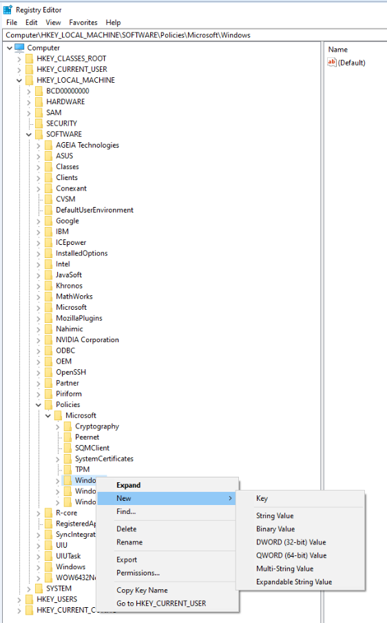
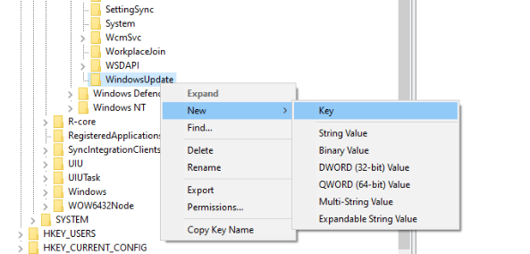
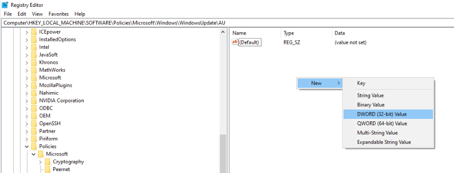
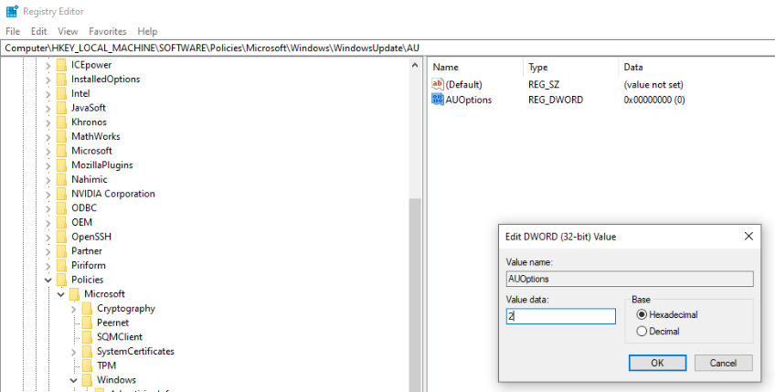

# Win10 update management

### To manage Win10 automatic update settings

It will change settings, Local Group Policy Editor for update management. Alongwith these, it has also instructions to change registry values.

## Level-1 - by changing Settings -
- Step 1 - Go to `Settings` > `Update and Security` > `Windows Update`
-	Step 2 - Click `Advanced Options`
-	Step 3 - Grant minimum permissions to Windows

This is the lowest level of control. But since Win10 is more focussed on pusing updates these days, it might still push updates. So, move to Level-2 for update management.

## Level-2 - by changing Local Group Policies -
* Step 1 - Use the shortcut `[Windows+R]` key to open the Run command.
*	Step 2 - Type `gpedit.msc` and click OK to open the Local Group Policy Editor.
*	Step 3 - Browse the following path: `Computer Configuration\Administrative Templates\Windows Components\Windows Update`
*	Step 4 - Double-click the `"Configure Automatic Updates"` policy.
*	Step 5 - On the left side, check the `Enabled` option to enable the policy. 
*	Under Options, you'll find a number of ways to configure automatic updates, like:
    * `2` - "Notify for download and notify for install."
    * `3` - "Auto download and notify for install."
    * `4` - "Auto download and schedule the install."
    * `5` - "Allow local admin to choose setting."
* Step 6 - Best choice is `2 - Notify for download and notify for install`. It will prevent the OS from downloading updates automatically, but you'll get a notification when new updates are available. Updates won't download and install until you'll click them manually.

This should stop updates. But if you still feel Win10 is invading your privacy by recusively changing your update settings, then you can make changes to registry.

## Level 3 - by changing Registry Values -
* Step 1 - Use the shortcut `[Windows+R]` key to open the Run command.
*	Step 2 - Type `regedit`, and click OK to open the `RegistryEditor`.
*	Step 3 - Browse the following path: `HKEY_LOCAL_MACHINE\SOFTWARE\Policies\Microsoft\Windows`
*	Step 4 - Right-click the Windows (folder) key, select New, and then click Key. (see pic 1)
*	Step 5 - Name the new key `WindowsUpdate` and press Enter.
*	Step 6 - Right-click the newly created key, select `New`, and click `Key`. (see pic 2)
*	Step 7 - Name the new key `AU` and press Enter.
*	Step 8 - Inside the newly created key, right-click on the right side, select `"New"`, and click on `"DWORD (32-bit) Value"`. (see pic 3)
*	Step 9 - Name the new key `AUOptions` and press Enter.
*	Step 10 - Double-click the newly created key and change its value using one of the following options: (see pic 4)
    * `2` - "Notify for download and notify for install."
    * `3` - "Auto download and notify for install."
    * `4` - "Auto download and schedule the install."
    * `5` - "Allow local admin to choose setting."
*	Step 11 - Click OK.
*	Step 12 - Close the Registry to complete the task.

Picture:1

Picture:2

Picture:3

Picture:4
<!--  -->
